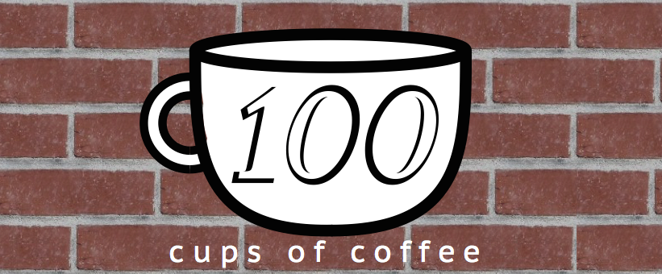

<section id="table-of-contents" class="toc">
  <header>
    <h3>Cups</h3>
  </header>

*  Auto generated table of contents
{:toc}

</section><!-- /#table-of-contents -->

Washington is home to large coffee chains and coffee shops that dedicate themselves to the craft of coffee. This is based on a challenge I saw <a href="http://www.thenerdygirlie.com/p/100cupsofcoffee_22.html">thenerdiegirlie</a> do on her Instagram and the evident fact: I love coffee. #100cupsofcoffee

# 19 
<table>
<tr>
<td width="65%"></td>
<td><b>10.11</b> First-time at a Stumptown - discovered while trying to find someplace to eat. Figured why not, I was trying to find someplace for coffee too.</td>
</tr>
</table>

# 18 
<table>
<tr>
<td width="65%"></td>
<td><b>10.10</b> Long week of work and hosting :) Woke up at 1 A.M to drink an Americano. Then proceeded to catch up on Fresh off the Boat on Hulu. </td>
</tr>
</table>

# 17 
<table>
<tr>
<td width="65%"></td>
<td><b>10.9</b> Microsoft Coffee. In 30 seconds or less, it's the machine's guarantee.</td>
</tr>
</table>

# 16 
<table>
<tr>
<td width="65%"></td>
<td><b>10.8</b> Microsoft Coffee. When paying for coffee doesn't do it for you.</td>
</tr>
</table>

# 15 
<table>
<tr>
<td width="65%"></td>
<td><b>10.7</b> Microsoft Coffee. Cause everybody is doing it.</td>
</tr>
</table>

# 14 
<table>
<tr>
<td width="65%"></td>
<td><b>10.6</b> "Why does anyone eat anything <i>but</i> breakfast food?" "People are idiots, Ron". A double shot redeye with spam & eggs</td>
</tr>
</table>

# 13 
<table>
<tr>
<td width="65%"></td>
<td><b>10.5</b> Microsoft Coffee. Comes out hot all the time.</td>
</tr>
</table>

# 12 
<table>
<tr>
<td width="65%"></td>
<td><b>10.4</b> he cappucino paired with the greatest lox bagel sandwich (I've) ever created.</td>
</tr>
</table>

# 11
<b>10.3</b> 

<blockquote class="instagram-media" data-instgrm-captioned data-instgrm-version="5" style=" background:#FFF; border:0; border-radius:3px; box-shadow:0 0 1px 0 rgba(0,0,0,0.5),0 1px 10px 0 rgba(0,0,0,0.15); margin: 1px; max-width:658px; padding:0; width:99.375%; width:-webkit-calc(100% - 2px); width:calc(100% - 2px);">
 
 

 
 <a href="https://instagram.com/p/8Z0w32Jit5/" style=" color:#000; font-family:Arial,sans-serif; font-size:14px; font-style:normal; font-weight:normal; line-height:17px; text-decoration:none; word-wrap:break-word;" target="_blank">The new Portage Bay on 65th. #fonte #100cupsofcoffee</a>
 
A photo posted by Joshua Rivera (@doswah) on <time style=" font-family:Arial,sans-serif; font-size:14px; line-height:17px;" datetime="2015-10-04T05:12:44+00:00">Oct 3, 2015 at 10:12pm PDT</time>

</blockquote>

# 10
<b>10.2</b> 

<blockquote class="instagram-media" data-instgrm-captioned data-instgrm-version="5" style=" background:#FFF; border:0; border-radius:3px; box-shadow:0 0 1px 0 rgba(0,0,0,0.5),0 1px 10px 0 rgba(0,0,0,0.15); margin: 1px; max-width:658px; padding:0; width:99.375%; width:-webkit-calc(100% - 2px); width:calc(100% - 2px);">
 
 

 
 <a href="https://instagram.com/p/8WC64FJiqt/" style=" color:#000; font-family:Arial,sans-serif; font-size:14px; font-style:normal; font-weight:normal; line-height:17px; text-decoration:none; word-wrap:break-word;" target="_blank">Foggy mornings are here. Happy Fall Y&#39;all. #pnwfall #100cupsofcoffee</a>
 
A photo posted by Joshua Rivera (@doswah) on <time style=" font-family:Arial,sans-serif; font-size:14px; line-height:17px;" datetime="2015-10-02T17:59:28+00:00">Oct 2, 2015 at 10:59am PDT</time>

</blockquote>

# 9
<table>
<tr>
<td width="65%"></td>
<td><b>10.1</b> Microsoft Coffee. Press a button out comes coffee.</td>
</tr>
</table>

# 8
<table>
<tr>
<td width="65%"></td>
<td><b>9.30</b> Americanos are for the days when you wake up just in time to get to work.</td>
</tr>
</table>

# 7
<b>9.29</b> 

<blockquote class="instagram-media" data-instgrm-captioned data-instgrm-version="5" style=" background:#FFF; border:0; border-radius:3px; box-shadow:0 0 1px 0 rgba(0,0,0,0.5),0 1px 10px 0 rgba(0,0,0,0.15); margin: 1px; max-width:658px; padding:0; width:99.375%; width:-webkit-calc(100% - 2px); width:calc(100% - 2px);">
 
 

 
 <a href="https://instagram.com/p/8OHrfXpimo/" style=" color:#000; font-family:Arial,sans-serif; font-size:14px; font-style:normal; font-weight:normal; line-height:17px; text-decoration:none; word-wrap:break-word;" target="_blank">Rise and grind. Happy #NationalCoffeeDay! Go out and caffeinate! #100cupsofcoffee</a>
 
A photo posted by Joshua Rivera (@doswah) on <time style=" font-family:Arial,sans-serif; font-size:14px; line-height:17px;" datetime="2015-09-29T16:07:08+00:00">Sep 29, 2015 at 9:07am PDT</time>

</blockquote>

# 6
<table>
<tr>
<td width="65%"></td>
<td><b>9.28</b>  Microsoft Coffee. They provide cups and lids.</td>
</tr>
</table>

# 5
<b>9.27</b> 

<blockquote class="instagram-media" data-instgrm-captioned data-instgrm-version="5" style=" background:#FFF; border:0; border-radius:3px; box-shadow:0 0 1px 0 rgba(0,0,0,0.5),0 1px 10px 0 rgba(0,0,0,0.15); margin: 1px; max-width:658px; padding:0; width:99.375%; width:-webkit-calc(100% - 2px); width:calc(100% - 2px);">
 
 

 
 <a href="https://instagram.com/p/8JYsU5pirg/" style=" color:#000; font-family:Arial,sans-serif; font-size:14px; font-style:normal; font-weight:normal; line-height:17px; text-decoration:none; word-wrap:break-word;" target="_blank">Starting the weekly grind. #100cupsofcoffee</a>
 
A photo posted by Joshua Rivera (@doswah) on <time style=" font-family:Arial,sans-serif; font-size:14px; line-height:17px;" datetime="2015-09-27T19:59:36+00:00">Sep 27, 2015 at 12:59pm PDT</time>

</blockquote>

# 4
<table>
<tr>
<td width="65%"></td>
<td><b>9.26</b> Late night coffee after the Found + Gathered Fall Supper.</td>
</tr>
</table>

# 3
<table>
<tr>
<td width="65%"></td>
<td><b>9.25</b> Downpour latte. Tweaking the sites.</td>
</tr>
</table>

# 2
<table>
<tr>
<td width="65%"></td>
<td><b>9.24</b>  Early morning at work.</td>
</tr>
</table>

# 1
<b>9.23</b> 

<blockquote class="instagram-media" data-instgrm-captioned data-instgrm-version="4" style=" background:#FFF; border:0; border-radius:3px; box-shadow:0 0 1px 0 rgba(0,0,0,0.5),0 1px 10px 0 rgba(0,0,0,0.15); margin: 1px; max-width:658px; padding:0; width:99.375%; width:-webkit-calc(100% - 2px); width:calc(100% - 2px);">
 
 

 
 <a href="https://instagram.com/p/7-80W6pimV/" style=" color:#000; font-family:Arial,sans-serif; font-size:14px; font-style:normal; font-weight:normal; line-height:17px; text-decoration:none; word-wrap:break-word;" target="_top">Time is money. Money is power. Power is coffee. Coffee is enlightenment. #100cupsofcoffee</a>
 
A photo posted by Joshua Rivera (@doswah) on <time style=" font-family:Arial,sans-serif; font-size:14px; line-height:17px;" datetime="2015-09-23T18:43:37+00:00">Sep 23, 2015 at 11:43am PDT</time>

</blockquote> 